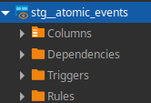
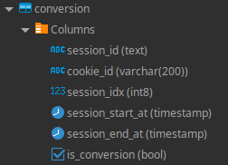
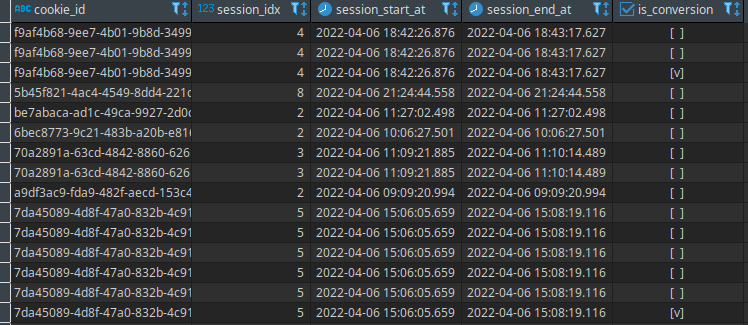
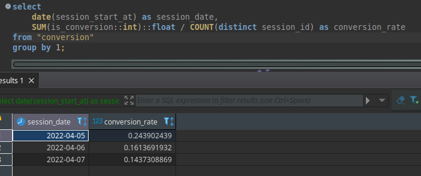
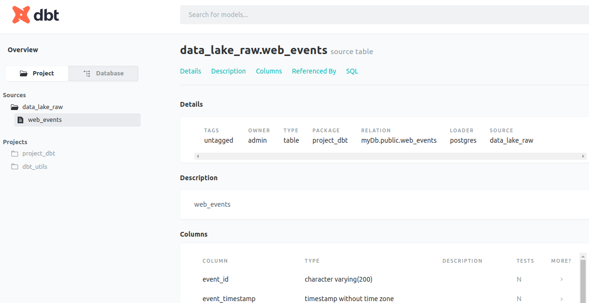

# Data Build Tool project

## Introduction

This project was created to explore the usage of Data Build Tool (DBT).

DBT is a tool that allows profissionals to transform, test and document data located at the Data Warehouse.

This [article](https://www.getdbt.com/blog/is-dbt-the-right-tool-for-my-data-transformations/#:~:text=dbt%20is%20not%20an%20ETL,extract%2C%20load%2C%20transform) enumerates reasons to use DBT into yours data platform projects.
To know more just visit the official webpage ([link](https://www.getdbt.com))

This project consists of a database containing users access logs. The main objective was to create a model to verify whether a user has arrived at the last section of the webpage (confirmation page) on a single session (30 minutes) and get it's conversion rate.

## How to run

Install the required packages:
```
pip install -r requirements.txt
```

Start the postgres server using docker-compose
```
docker-compose up -d
```

To populate the database run the ingestion script:
```
python3 db_ingestion_script/insert.py
```
Interrupt the execution when there is enougth data.

Run the models to create the respectives views.
```
dbt run
```
To generate the documentation just run:
```
dbt docs generate
dbt docs serve
```

## Models

Two models were created:

* staging: model that only replicates the data from the postgres instance. It renames the column user_domain_id to cookie_id. Creates stg__atomic_events view.



* mart: model that do more complex operations. Based on the view created at staging step it verifyes if the user was converted. If the user lands the first page and get to the confirmation page at the same session (30 minutes apart), the user is considered to have been converted. To check this basically some window functions were implemented to do the analysis, calculating the session time and checking the arrival at confirmation page. Creates convertion view.



Example of rows at the convertion view:



Calculation of convertion rate by day:




## Documentation

DBT genarates docs easilly. To access it just access port 8000 of the localhost, after seerving it using the CLI.


